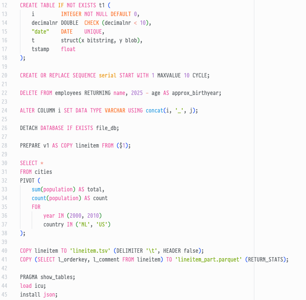
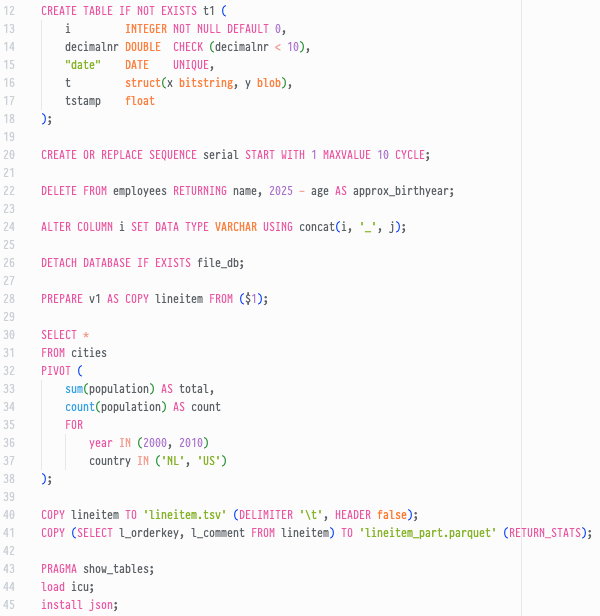

# QuackSyntax README

QuackSyntax offers syntax highlighting for SQL. It is tailored to DuckDB's SQL dialect.

## Features

VS Code's internal syntax highlighting of SQL has a few shortcomings that this extension should fix. Highlighting includes DuckDB-specific features like `SELECT * EXCLUDE(x)`, `PRAGMA` and more.

|   Internal syntax highlighting    |           QuackSyntax           |
| :-------------------------------: | :-----------------------------: |
|  |  |

## Requirements

None.

## Extension Settings

This extension contributes no settings.

## Known Issues

Please report issues on GitHub: https://github.com/OrangieLou/QuackSyntax/issues

## Release Notes

April 1, 2026: initial release
